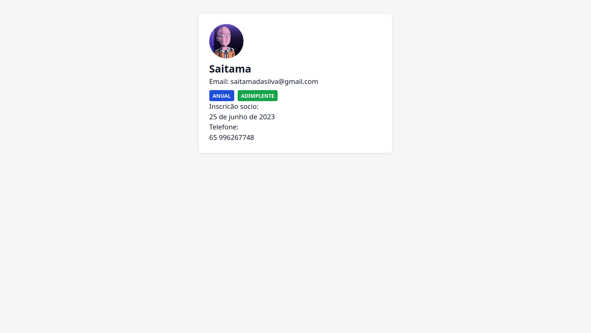
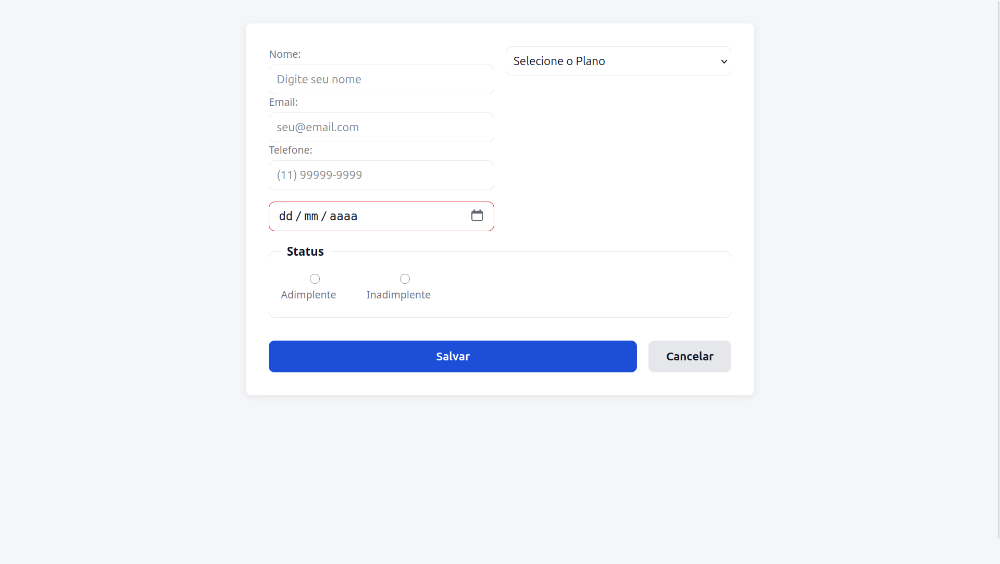

# Projeto: Atlus-Trojan | Fase 1

**Aluno:** Breno | **Mentor:** Rodrigo

Este repositório contém os exercícios práticos da Fase 1 do roadmap de estudos. O objetivo principal desta etapa é dominar a estruturação de páginas web "nos bastidores" e a estilização responsiva utilizando estritamente HTML semântico e CSS puro, sem o uso de frameworks como React ou TypeScript[cite: 8].

## 🎯 Exercícios Concluídos (Semana 1)

### Exercício 1.1 — Cartão de Sócio

Implementação de um cartão de perfil de usuário focado em estrutura física e alinhamento[cite: 8].

- **Conceitos Aplicados:** HTML Semântico (`<article>`, `<header>`, e listas de descrição `<dl>`) e CSS Box Model[cite: 8].
- **Layout e Design:** Utilização de Flexbox para alinhamento do cabeçalho e Variáveis CSS (Custom Properties) para aplicação rigorosa do sistema de cores do projeto[cite: 8].
- **Responsividade:** Uso de _Media Queries_ (`max-width: 480px`) para empilhar o avatar e o texto em dispositivos móveis[cite: 8].

### Exercício 1.2 — Formulário de Novo Sócio

Construção de um formulário interativo de cadastro, delegando o trabalho pesado de validação inteiramente para o navegador[cite: 8].

- **Conceitos Aplicados:** Validação nativa do HTML5 (uso de atributos como `required`, `minlength`, e `pattern` para formato de email) e marcação acessível (`<form>`, `<label>`, `<fieldset>`)[cite: 8].
- **Layout em Grid:** Estruturação dos campos utilizando CSS Grid em 2 colunas, com adaptação para 1 coluna no mobile[cite: 8].
- **Estados Visuais (CSS Puro):** Implementação de pseudo-classes (`:focus`, `:valid`, `:invalid:not(:placeholder-shown)`) para fornecer feedback visual instantâneo (verde para correto, vermelho para erro) durante a digitação, sem a necessidade de JavaScript[cite: 8].

## 🛠️ Como Executar o Projeto

1. Clone este repositório para a sua máquina.
2. Abra a pasta raiz `atlus-fase1` no VS Code[cite: 8].
3. Certifique-se de ter a extensão **Live Server** instalada[cite: 8].
4. Clique no botão "Go Live" na barra inferior do editor para visualizar o projeto no navegador (`http://127.0.0.1:5500`)[cite: 8].
